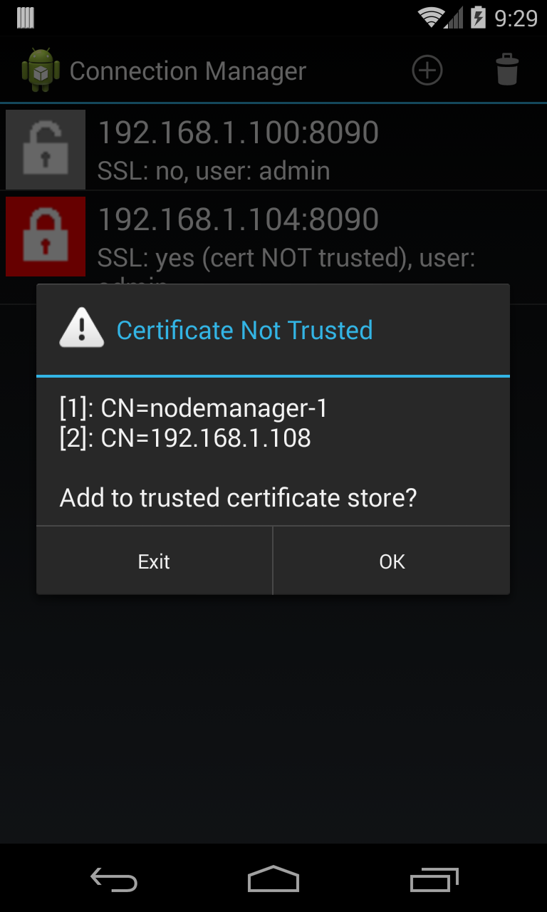
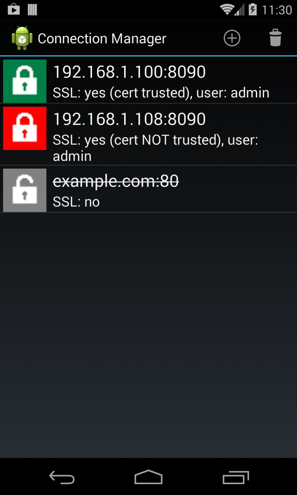
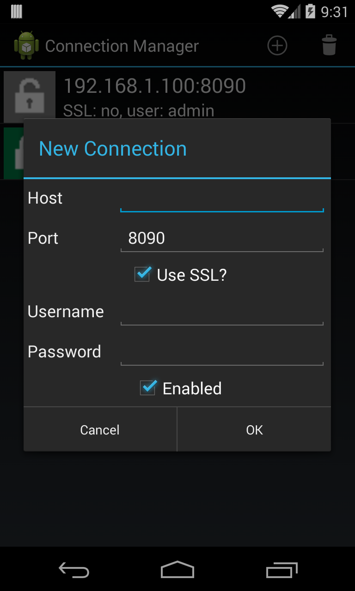
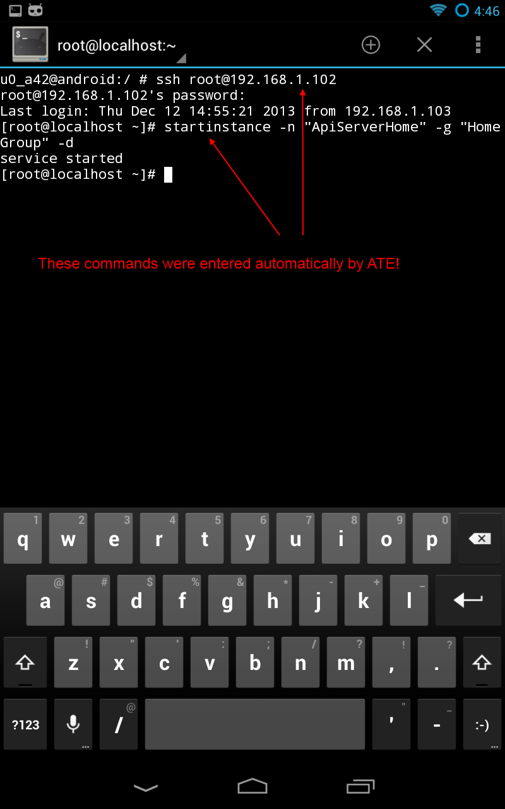

ATE - Android Topology Editor
===

Android Topology Editor is an Android (4.1 and above) application which employs API Server's management REST API to view and edit API Server topologies.

In my initial attempt to create this tool I tried to integrate the Sun Jersey client jars into my Android environment. 
However, I ultimately found that Android's Java implementation did not provide the necessary support for Jersey. In the end,
I chose Spring's Android framework for REST API support and I'm quite happy with it (for example, it was a breeze to add custom
SSL support). Although, I did roll my own Json marshalling because Spring's framework didn't like Jersey's JAXB annotations.

### Features ###

* Connection Manager - to manage connections to various servers
* SSL Support - allows for easy SSL certificate trusting
* Work locally - allows saving/loading topologies to/from files
* Console - if you have a Terminal Emulator app on your device, you can SSH to your host(s) and/or start Gateways with a menu selection (currently works only with the jackpal.androidterm package)

### Dependencies ###
* API Server's common.jar and server.jar
* spring-android-core 
* spring-android-rest-template
* httpclient-4.2.2.jar
* gson-2.1.jar

### Android Components used ###
I experimented with a lot of the different framework components. I started out with an Android Service object to which I binded my Activities.
This worked fairly well, but the communication between the service and activities was somewhat cumbersome. I also tried just doing the bulk
of the work in one main activity with some AsyncTasks but I didn't like all the "listeners" I ended up having to implement.
I finally decided to use an IntentService to do the async work. I use them a lot; they're nice because the async part is built right in and 
there's no need to worry about AsyncTasks. Fragment objects are used for display and Activity objects for communication with the IntentService. 
The Connection Manager is backed by a ContentProvider implementation and SQLite database. Oh, and Intent objects; they're used everywhere in 
Android to communicate amongst components.

### Screenshots ###

&nbsp;
&nbsp;
&nbsp;
&nbsp;
&nbsp;
&nbsp;

### Wishlist ###
* Finish moving string constants into res/strings.xml
* Implement customizable SSH user for 'SSH to host' command (currently uses root)

### Known issues ###
* Does moving a Gateway from one Group to another make sense? (I'm thinking not)
* So far unable to query for an existing Gateway's Services Port. Adding 'servicesPort' param on the POST works fine, but for an existing Gateway how to know the Services Port?

I'm sure there are some others! :)
